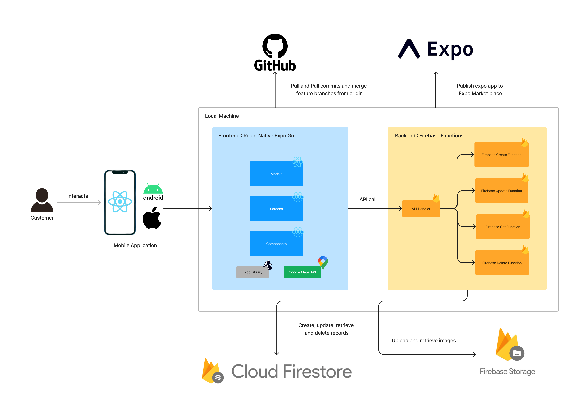

# Pet Channelling Mobile App 🐶

<div style="display:flex; flex-wrap:wrap;">
  
 </div>

This is a pet channelling mobile application where the user would be able to book an appointment, from the admin side staff would be managed such as the doctors, users would be able to give a review of their experience and finally users would be able to add a pet for anyone to adopt that particular pet.

## Architecture Diagram

Below illustrates the architecture diagram of the system in a high-level view. The diagram was custom-drawn using Figma.

<div style="display:flex; flex-wrap:wrap;">
  
 </div>

## Features

- Create,Update, Delete, Retrieve, List, Search
- Camera Access and Preveiw
- Location Access and Preview
- Image Upload & Retriev

## Screenshots

The following screens are the screenshots of the live mobile app running.

<div style="display:flex; flex-wrap:wrap;">
  
  
  
 </div>

## Technology Stack

The following are the technologies used within this pet channeling mobile application. In order to run this mobile app the following technologies are the prerequisites.

<div style="display:flex; flex-wrap:wrap;">
  
 </div>

## Get Started

#### 1. Installation

On the command prompt run the following commands

```sh
$ git clone https://github.com/IT20206864/pet-channeling.git

$ cd pet-channeling/

$ npm install
```

#### 2. Run on for iOS, Android or Web

```sh
$ npm run ios

$ npm run android

$ npm run web
```

## Authors

In the below table shoows the memebers who contributed to the project dedicating their time and effort.

| Name                  | Email                  | IT Number    |
| --------------------- | ---------------------- | ------------ |
| `S.K. Shehan`         | it20206864@my.sliit.lk | `it20206864` |
| `Dissanayake M.C.Y.D` | it20013332@my.sliit.lk | `it20013332` |
| `Jayasinghe H.A.S`    | it20222222@my.sliit.lk | `it20222222` |
| `Dilshan B.K.R.`      | it19967080@my.sliit.lk | `it19967080` |
